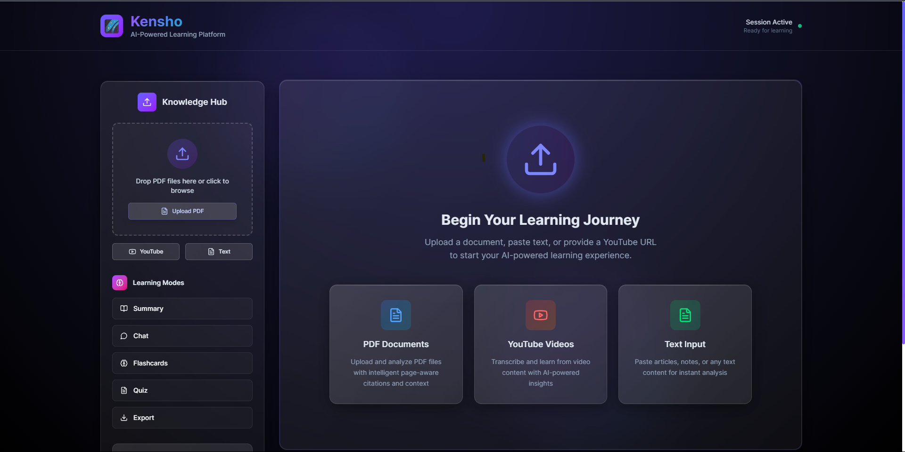
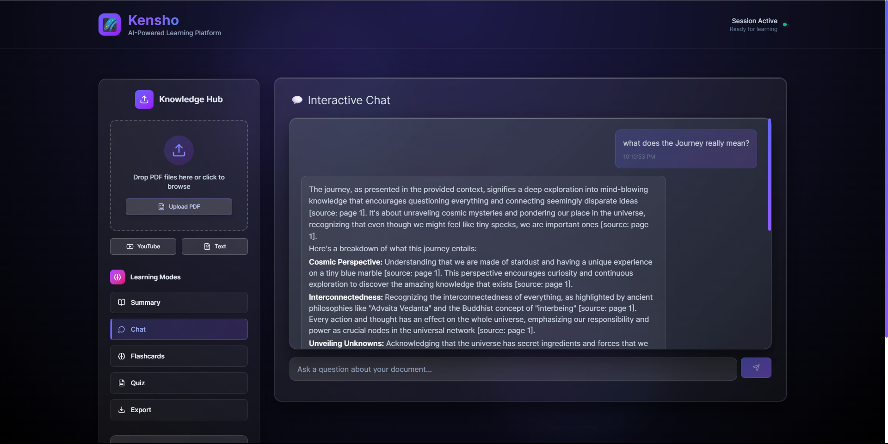
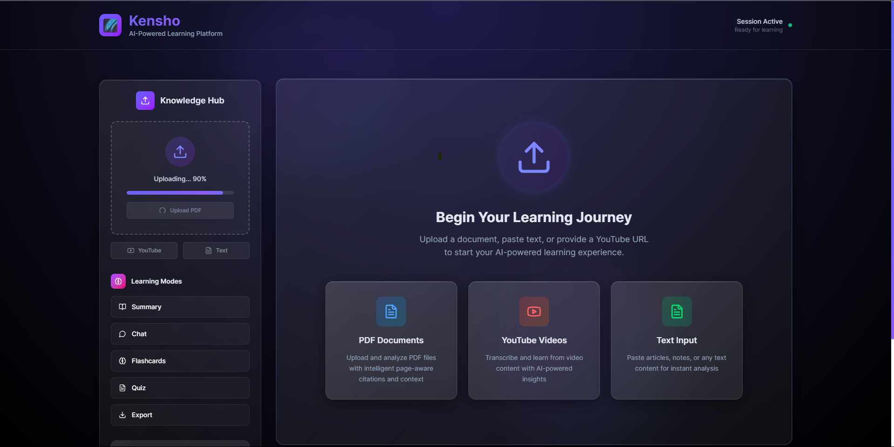
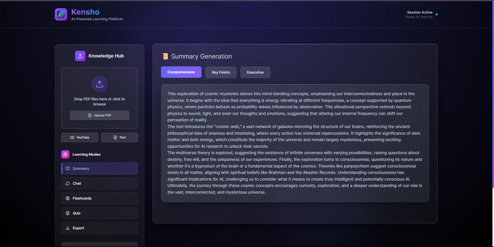
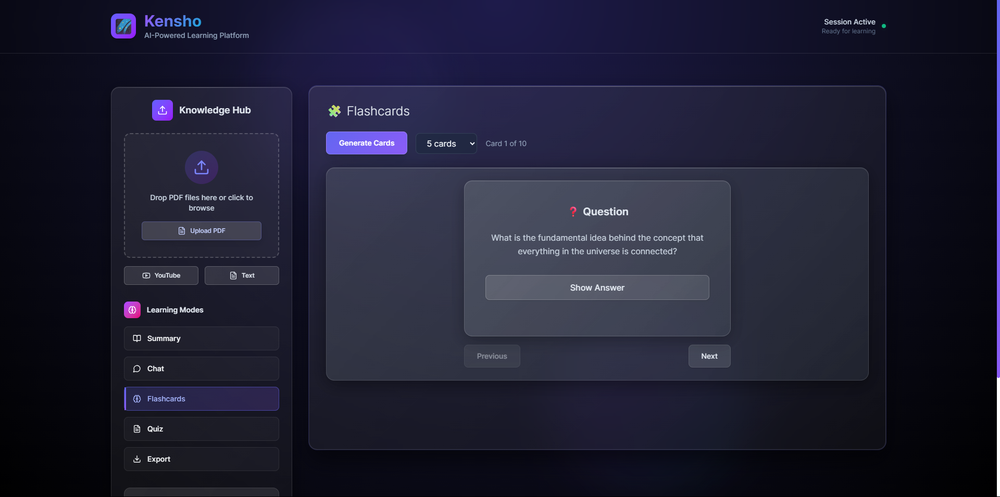

# 🌌 Kensho - AI Learning Assistant

> *Mindful learning through AI-powered document analysis and interaction*

<div align="center">


[](https://python.org)
[](https://nodejs.org)
[](https://fastapi.tiangolo.com)
[](https://nextjs.org)
[](LICENSE)

</div>

Kensho is an intelligent learning companion that transforms how you interact with documents, PDFs, and YouTube videos. Using advanced AI, it helps you understand, analyze, and learn from your content through interactive conversations, smart summaries, flashcards, and quizzes.

## 📸 Screenshots

<div align="center">

### 🏠 **Main Dashboard**

*Clean, intuitive interface with session management and quick actions*

### 💬 **Interactive Chat**

*AI-powered conversations with markdown support and source citations*

### 📄 **Document Processing**

*Seamless PDF upload and processing with real-time status updates*

### 🧠 **Smart Summaries**

*Comprehensive content summaries with key insights and takeaways*

### 🃏 **Flashcards**

*Interactive study cards generated from your content using Bloom's taxonomy*

### 🧩 **Interactive Quizzes**

*Engaging quizzes with multiple choice questions and instant feedback*

</div>

## ✨ Features

### 📄 **Document Processing**
- **PDF Analysis**: Upload and analyze PDF documents with intelligent text extraction
- **Text Processing**: Direct text input for quick analysis
- **Multi-format Support**: Handles various document types and layouts

### 🎥 **YouTube Integration** 
- **Video Transcription**: Extract insights from YouTube videos
- **Audio Processing**: Advanced transcription with timestamp support
- **Content Analysis**: Deep understanding of video content

### 💬 **Interactive Chat**
- **Contextual Q&A**: Ask questions about your uploaded content
- **Smart Responses**: AI-powered answers with source citations
- **Markdown Support**: Beautiful formatting for all responses

### 📝 **Learning Tools**
- **Smart Summaries**: Generate comprehensive content summaries
- **Flashcards**: Auto-generated study cards based on Bloom's taxonomy
- **Interactive Quizzes**: Test your knowledge with AI-generated questions
- **Export Options**: Save your learning materials in various formats

### 🎨 **Modern Interface**
- **Beautiful UI**: Clean, responsive design with dark theme
- **Smooth Animations**: Engaging user experience
- **Real-time Updates**: Live progress tracking and status updates

## 🚀 Quick Start

### Prerequisites

Make sure you have the following installed:

#### System Requirements
- **Python 3.10+** ([Download](https://python.org/downloads/))
- **Node.js 18+** ([Download](https://nodejs.org/))
- **Git** ([Download](https://git-scm.com/))

#### Required System Packages

**Windows:**
```bash
# Install ffmpeg using chocolatey
choco install ffmpeg

# Or download from: https://ffmpeg.org/download.html
```

**macOS:**
```bash
# Install using homebrew
brew install ffmpeg
```

**Linux (Ubuntu/Debian):**
```bash
sudo apt update
sudo apt install ffmpeg build-essential
```

#### API Keys Required
- **Gemini API Key**: Get from [Google AI Studio](https://aistudio.google.com/app/apikey)
- **Groq API Key**: Get from [Groq Console](https://console.groq.com/keys)

### Installation

1. **Clone the Repository**
```bash
git clone https://github.com/shahdivax/Kensho.git
cd kensho
```

2. **Set Up Python Environment**
```bash
# Create virtual environment
python -m venv venv

# Activate virtual environment
# Windows:
venv\Scripts\activate
# macOS/Linux:
source venv/bin/activate

# Install Python dependencies
pip install -r requirements.txt
```

3. **Set Up Frontend**
```bash
cd frontend
npm install
cd ..
```

4. **Configure Environment**
```bash
# Copy environment template
cp env_example.txt .env

# Edit .env file with your API keys
# Add your GEMINI_API_KEY and GROQ_API_KEY
```

5. **Start the Application**

**Option A: Development Mode**
```bash
# Terminal 1 - Start Backend
python start_api.py

# Terminal 2 - Start Frontend
cd frontend
npm run dev
```

**Option B: Production Mode**
```bash
# Build and start everything
docker-compose up --build
```

6. **Open Your Browser**
- Frontend: http://localhost:3000
- API Docs: http://localhost:8000/docs

## 📚 Documentation

- **[Hugging Face Deployment](docs/README_HUGGINGFACE.md)** - Deploy to Hugging Face Spaces
- **[Setup Guide](docs/SETUP.md)** - Detailed setup instructions
- **[API Reference](http://localhost:8000/docs)** - FastAPI documentation (when running)

## 🛠️ Development

### Project Structure
```
kensho/
├── 🎨 frontend/          # Next.js React frontend
├── 🧠 kensho/           # Core Python modules
├── 🐳 docker/           # Docker configuration
├── 📚 docs/             # Documentation
├── 🔧 api_server.py     # FastAPI backend
├── 📋 requirements.txt   # Python dependencies
└── 🐳 Dockerfile        # Container configuration
```

### Core Components

- **Document Processor**: Handles PDF parsing and text extraction
- **Vector Store**: ChromaDB for semantic search and retrieval
- **AI Assistant**: Integrates Gemini and Groq for intelligent responses
- **Frontend**: Modern React interface with Tailwind CSS

### Available Scripts

**Backend:**
```bash
python api_server.py          # Start FastAPI server
python test_kensho.py         # Run tests
```

**Frontend:**
```bash
npm run dev                   # Development server
npm run build                 # Production build
npm run start                 # Production server
npm run lint                  # Code linting
```

## 🐳 Docker Deployment

### Local Docker
```bash
# Build and run
docker build -t kensho .
docker run -p 7860:7860 -e GEMINI_API_KEY=your_key -e GROQ_API_KEY=your_key kensho
```

### Docker Compose
```bash
# Development
docker-compose up --build

# Production
docker-compose -f docker-compose.prod.yml up --build
```

## 🌍 Deployment Options

### Hugging Face Spaces
Deploy to Hugging Face for free hosting. See [Deployment Guide](docs/README_HUGGINGFACE.md).

### Other Platforms
- **Vercel**: Frontend deployment
- **Railway**: Full-stack deployment  
- **AWS/GCP/Azure**: Cloud deployment
- **DigitalOcean**: VPS deployment

## 🔧 Environment Variables

| Variable | Description | Required | Default |
|----------|-------------|----------|---------|
| `GEMINI_API_KEY` | Google Gemini API key | ✅ Yes | - |
| `GROQ_API_KEY` | Groq API key | ✅ Yes | - |
| `PORT` | Server port | ❌ No | 8000 |
| `HOST` | Server host | ❌ No | 0.0.0.0 |
| `NEXT_PUBLIC_API_URL` | Frontend API URL | ❌ No | http://localhost:8000 |

## 🤝 Contributing

We welcome contributions! Please see our [Contributing Guide](CONTRIBUTING.md) for details.

1. Fork the repository
2. Create a feature branch
3. Make your changes
4. Add tests if applicable
5. Submit a pull request

## 📄 License

This project is licensed under the MIT License - see the [LICENSE](LICENSE) file for details.

## 🆘 Support

Having issues? Here's how to get help:

1. **Check the [Documentation](docs/)**
2. **Search [Issues](https://github.com/yourusername/kensho/issues)**
3. **Create a [New Issue](https://github.com/yourusername/kensho/issues/new)**
4. **Join our [Discord](https://discord.gg/kensho)** (if available)

## 🙏 Acknowledgments

- **Google Gemini** - Advanced AI capabilities
- **Groq** - Fast inference engine
- **Hugging Face** - Model hosting and deployment
- **Next.js** - Amazing React framework
- **FastAPI** - Modern Python web framework

## 🎯 Roadmap

- [ ] **Multi-language Support** - Support for multiple languages
- [ ] **Advanced Analytics** - Learning progress tracking
- [ ] **Collaborative Features** - Share sessions with others
- [ ] **Mobile App** - Native mobile applications
- [ ] **Plugin System** - Extensible architecture
- [ ] **Advanced Export** - More export formats

---

<div align="center">

**Made with 🧘‍♂️ for mindful learning**

[Documentation](docs/) • [Contributing](CONTRIBUTING.md) • [License](LICENSE) • [Changelog](CHANGELOG.md)

</div>